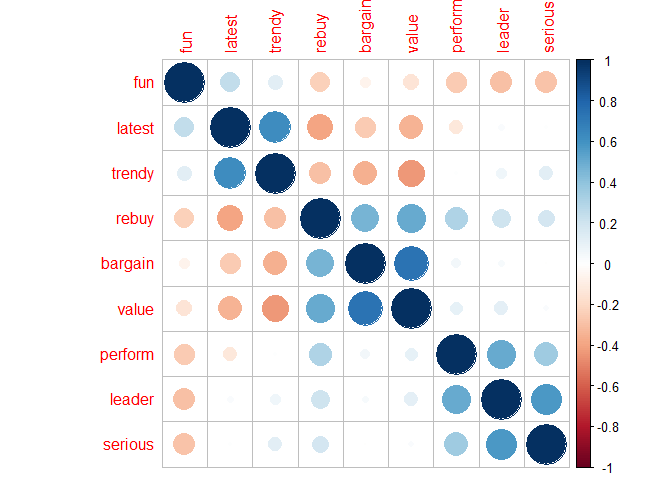
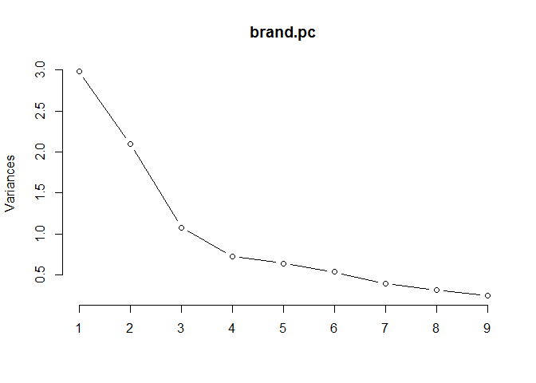
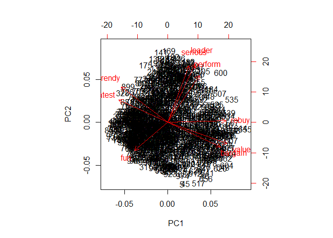
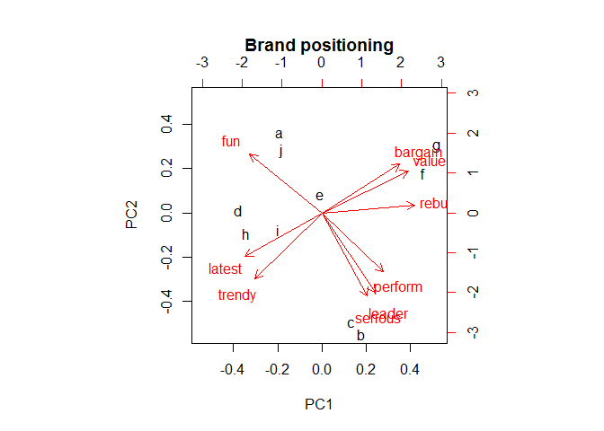
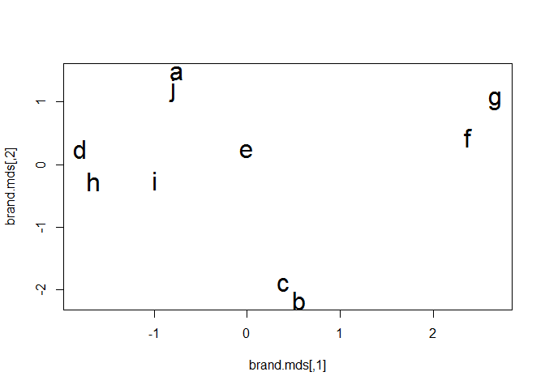
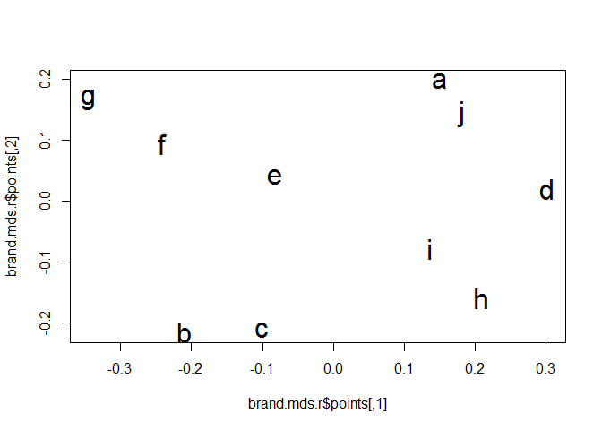

Dimensionality Reduction
================

1.  Data preparation

``` r
brand.ratings <- read.csv("http://goo.gl/IQl8nc")
head(brand.ratings)
```

    ##   perform leader latest fun serious bargain value trendy rebuy brand
    ## 1       2      4      8   8       2       9     7      4     6     a
    ## 2       1      1      4   7       1       1     1      2     2     a
    ## 3       2      3      5   9       2       9     5      1     6     a
    ## 4       1      6     10   8       3       4     5      2     1     a
    ## 5       1      1      5   8       1       9     9      1     1     a
    ## 6       2      8      9   5       3       8     7      1     2     a

``` r
tail(brand.ratings)
```

    ##      perform leader latest fun serious bargain value trendy rebuy brand
    ## 995        4      2      8   7       1       3     3      5     2     j
    ## 996        2      2      3   6       4       8     5      1     2     j
    ## 997        3      2      6   7       1       3     3      2     1     j
    ## 998        1      1     10  10       1       6     5      5     2     j
    ## 999        1      1      7   5       1       1     2      5     1     j
    ## 1000       7      4      7   8       4       1     2      5     1     j

``` r
summary(brand.ratings)
```

    ##     perform           leader           latest            fun        
    ##  Min.   : 1.000   Min.   : 1.000   Min.   : 1.000   Min.   : 1.000  
    ##  1st Qu.: 1.000   1st Qu.: 2.000   1st Qu.: 4.000   1st Qu.: 4.000  
    ##  Median : 4.000   Median : 4.000   Median : 7.000   Median : 6.000  
    ##  Mean   : 4.488   Mean   : 4.417   Mean   : 6.195   Mean   : 6.068  
    ##  3rd Qu.: 7.000   3rd Qu.: 6.000   3rd Qu.: 9.000   3rd Qu.: 8.000  
    ##  Max.   :10.000   Max.   :10.000   Max.   :10.000   Max.   :10.000  
    ##                                                                     
    ##     serious          bargain           value            trendy     
    ##  Min.   : 1.000   Min.   : 1.000   Min.   : 1.000   Min.   : 1.00  
    ##  1st Qu.: 2.000   1st Qu.: 2.000   1st Qu.: 2.000   1st Qu.: 3.00  
    ##  Median : 4.000   Median : 4.000   Median : 4.000   Median : 5.00  
    ##  Mean   : 4.323   Mean   : 4.259   Mean   : 4.337   Mean   : 5.22  
    ##  3rd Qu.: 6.000   3rd Qu.: 6.000   3rd Qu.: 6.000   3rd Qu.: 7.00  
    ##  Max.   :10.000   Max.   :10.000   Max.   :10.000   Max.   :10.00  
    ##                                                                    
    ##      rebuy            brand    
    ##  Min.   : 1.000   a      :100  
    ##  1st Qu.: 1.000   b      :100  
    ##  Median : 3.000   c      :100  
    ##  Mean   : 3.727   d      :100  
    ##  3rd Qu.: 5.000   e      :100  
    ##  Max.   :10.000   f      :100  
    ##                   (Other):400

``` r
str(brand.ratings)
```

    ## 'data.frame':    1000 obs. of  10 variables:
    ##  $ perform: int  2 1 2 1 1 2 1 2 2 3 ...
    ##  $ leader : int  4 1 3 6 1 8 1 1 1 1 ...
    ##  $ latest : int  8 4 5 10 5 9 5 7 8 9 ...
    ##  $ fun    : int  8 7 9 8 8 5 7 5 10 8 ...
    ##  $ serious: int  2 1 2 3 1 3 1 2 1 1 ...
    ##  $ bargain: int  9 1 9 4 9 8 5 8 7 3 ...
    ##  $ value  : int  7 1 5 5 9 7 1 7 7 3 ...
    ##  $ trendy : int  4 2 1 2 1 1 1 7 5 4 ...
    ##  $ rebuy  : int  6 2 6 1 1 2 1 1 1 1 ...
    ##  $ brand  : Factor w/ 10 levels "a","b","c","d",..: 1 1 1 1 1 1 1 1 1 1 ...

``` r
brand.sc <- brand.ratings
brand.sc[, 1:9] <- scale(brand.ratings[, 1:9])
summary(brand.sc)
```

    ##     perform            leader            latest             fun          
    ##  Min.   :-1.0888   Min.   :-1.3100   Min.   :-1.6878   Min.   :-1.84677  
    ##  1st Qu.:-1.0888   1st Qu.:-0.9266   1st Qu.:-0.7131   1st Qu.:-0.75358  
    ##  Median :-0.1523   Median :-0.1599   Median : 0.2615   Median :-0.02478  
    ##  Mean   : 0.0000   Mean   : 0.0000   Mean   : 0.0000   Mean   : 0.00000  
    ##  3rd Qu.: 0.7842   3rd Qu.: 0.6069   3rd Qu.: 0.9113   3rd Qu.: 0.70402  
    ##  Max.   : 1.7206   Max.   : 2.1404   Max.   : 1.2362   Max.   : 1.43281  
    ##                                                                          
    ##     serious           bargain             value             trendy        
    ##  Min.   :-1.1961   Min.   :-1.22196   Min.   :-1.3912   Min.   :-1.53897  
    ##  1st Qu.:-0.8362   1st Qu.:-0.84701   1st Qu.:-0.9743   1st Qu.:-0.80960  
    ##  Median :-0.1163   Median :-0.09711   Median :-0.1405   Median :-0.08023  
    ##  Mean   : 0.0000   Mean   : 0.00000   Mean   : 0.0000   Mean   : 0.00000  
    ##  3rd Qu.: 0.6036   3rd Qu.: 0.65279   3rd Qu.: 0.6933   3rd Qu.: 0.64914  
    ##  Max.   : 2.0434   Max.   : 2.15258   Max.   : 2.3610   Max.   : 1.74319  
    ##                                                                           
    ##      rebuy             brand    
    ##  Min.   :-1.0717   a      :100  
    ##  1st Qu.:-1.0717   b      :100  
    ##  Median :-0.2857   c      :100  
    ##  Mean   : 0.0000   d      :100  
    ##  3rd Qu.: 0.5003   e      :100  
    ##  Max.   : 2.4652   f      :100  
    ##                    (Other):400

``` r
library(corrplot)
```

    ## Warning: package 'corrplot' was built under R version 3.6.1

    ## corrplot 0.84 loaded

``` r
corrplot(cor(brand.sc[, 1:9]), order="hclust")
```



``` r
brand.mean <- aggregate(. ~ brand, data=brand.sc, mean)
brand.mean
```

    ##    brand     perform     leader     latest        fun     serious
    ## 1      a -0.88591874 -0.5279035  0.4109732  0.6566458 -0.91894067
    ## 2      b  0.93087022  1.0707584  0.7261069 -0.9722147  1.18314061
    ## 3      c  0.64992347  1.1627677 -0.1023372 -0.8446753  1.22273461
    ## 4      d -0.67989112 -0.5930767  0.3524948  0.1865719 -0.69217505
    ## 5      e -0.56439079  0.1928362  0.4564564  0.2958914  0.04211361
    ## 6      f -0.05868665  0.2695106 -1.2621589 -0.2179102  0.58923066
    ## 7      g  0.91838369 -0.1675336 -1.2849005 -0.5167168 -0.53379906
    ## 8      h -0.01498383 -0.2978802  0.5019396  0.7149495 -0.14145855
    ## 9      i  0.33463879 -0.3208825  0.3557436  0.4124989 -0.14865746
    ## 10     j -0.62994504 -0.7885965 -0.1543180  0.2849595 -0.60218870
    ##        bargain       value      trendy       rebuy
    ## 1   0.21409609  0.18469264 -0.52514473 -0.59616642
    ## 2   0.04161938  0.15133957  0.74030819  0.23697320
    ## 3  -0.60704302 -0.44067747  0.02552787 -0.13243776
    ## 4  -0.88075605 -0.93263529  0.73666135 -0.49398892
    ## 5   0.55155051  0.41816415  0.13857986  0.03654811
    ## 6   0.87400696  1.02268859 -0.81324496  1.35699580
    ## 7   0.89650392  1.25616009 -1.27639344  1.36092571
    ## 8  -0.73827529 -0.78254646  0.86430070 -0.60402622
    ## 9  -0.25459062 -0.80339213  0.59078782 -0.20317603
    ## 10 -0.09711188 -0.07379367 -0.48138267 -0.96164748

``` r
rownames(brand.mean) <- brand.mean[, 1] # use brand for the row names
brand.mean <- brand.mean[, -1]
brand.mean
```

    ##       perform     leader     latest        fun     serious     bargain
    ## a -0.88591874 -0.5279035  0.4109732  0.6566458 -0.91894067  0.21409609
    ## b  0.93087022  1.0707584  0.7261069 -0.9722147  1.18314061  0.04161938
    ## c  0.64992347  1.1627677 -0.1023372 -0.8446753  1.22273461 -0.60704302
    ## d -0.67989112 -0.5930767  0.3524948  0.1865719 -0.69217505 -0.88075605
    ## e -0.56439079  0.1928362  0.4564564  0.2958914  0.04211361  0.55155051
    ## f -0.05868665  0.2695106 -1.2621589 -0.2179102  0.58923066  0.87400696
    ## g  0.91838369 -0.1675336 -1.2849005 -0.5167168 -0.53379906  0.89650392
    ## h -0.01498383 -0.2978802  0.5019396  0.7149495 -0.14145855 -0.73827529
    ## i  0.33463879 -0.3208825  0.3557436  0.4124989 -0.14865746 -0.25459062
    ## j -0.62994504 -0.7885965 -0.1543180  0.2849595 -0.60218870 -0.09711188
    ##         value      trendy       rebuy
    ## a  0.18469264 -0.52514473 -0.59616642
    ## b  0.15133957  0.74030819  0.23697320
    ## c -0.44067747  0.02552787 -0.13243776
    ## d -0.93263529  0.73666135 -0.49398892
    ## e  0.41816415  0.13857986  0.03654811
    ## f  1.02268859 -0.81324496  1.35699580
    ## g  1.25616009 -1.27639344  1.36092571
    ## h -0.78254646  0.86430070 -0.60402622
    ## i -0.80339213  0.59078782 -0.20317603
    ## j -0.07379367 -0.48138267 -0.96164748

1.  Principal Component Analysis

``` r
brand.pc <- prcomp(brand.sc[, 1:9])
summary(brand.pc)
```

    ## Importance of components:
    ##                          PC1    PC2    PC3    PC4     PC5     PC6     PC7
    ## Standard deviation     1.726 1.4479 1.0389 0.8528 0.79846 0.73133 0.62458
    ## Proportion of Variance 0.331 0.2329 0.1199 0.0808 0.07084 0.05943 0.04334
    ## Cumulative Proportion  0.331 0.5640 0.6839 0.7647 0.83554 0.89497 0.93831
    ##                            PC8     PC9
    ## Standard deviation     0.55861 0.49310
    ## Proportion of Variance 0.03467 0.02702
    ## Cumulative Proportion  0.97298 1.00000

``` r
plot(brand.pc, type="l")
```



``` r
biplot(brand.pc)
```



``` r
str(brand.mean)
```

    ## 'data.frame':    10 obs. of  9 variables:
    ##  $ perform: num  -0.886 0.931 0.65 -0.68 -0.564 ...
    ##  $ leader : num  -0.528 1.071 1.163 -0.593 0.193 ...
    ##  $ latest : num  0.411 0.726 -0.102 0.352 0.456 ...
    ##  $ fun    : num  0.657 -0.972 -0.845 0.187 0.296 ...
    ##  $ serious: num  -0.9189 1.1831 1.2227 -0.6922 0.0421 ...
    ##  $ bargain: num  0.2141 0.0416 -0.607 -0.8808 0.5516 ...
    ##  $ value  : num  0.185 0.151 -0.441 -0.933 0.418 ...
    ##  $ trendy : num  -0.5251 0.7403 0.0255 0.7367 0.1386 ...
    ##  $ rebuy  : num  -0.5962 0.237 -0.1324 -0.494 0.0365 ...

``` r
brand.mu.pc <- prcomp(brand.mean, scale=TRUE)
summary(brand.mu.pc)
```

    ## Importance of components:
    ##                           PC1    PC2    PC3     PC4     PC5     PC6
    ## Standard deviation     2.1345 1.7349 0.7690 0.61498 0.50983 0.36662
    ## Proportion of Variance 0.5062 0.3345 0.0657 0.04202 0.02888 0.01493
    ## Cumulative Proportion  0.5062 0.8407 0.9064 0.94842 0.97730 0.99223
    ##                            PC7     PC8     PC9
    ## Standard deviation     0.21506 0.14588 0.04867
    ## Proportion of Variance 0.00514 0.00236 0.00026
    ## Cumulative Proportion  0.99737 0.99974 1.00000

``` r
biplot(brand.mu.pc, main="Brand positioning")
```



1.  Exploratory Factor Analysis

``` r
library(nFactors)
```

    ## Warning: package 'nFactors' was built under R version 3.6.1

    ## Loading required package: MASS

    ## Loading required package: psych

    ## Warning: package 'psych' was built under R version 3.6.1

    ## Loading required package: boot

    ## 
    ## Attaching package: 'boot'

    ## The following object is masked from 'package:psych':
    ## 
    ##     logit

    ## Loading required package: lattice

    ## 
    ## Attaching package: 'lattice'

    ## The following object is masked from 'package:boot':
    ## 
    ##     melanoma

    ## 
    ## Attaching package: 'nFactors'

    ## The following object is masked from 'package:lattice':
    ## 
    ##     parallel

``` r
nScree(brand.sc[, 1:9])
```

    ##   noc naf nparallel nkaiser
    ## 1   3   2         3       3

``` r
eigen(cor(brand.sc[, 1:9]))
```

    ## eigen() decomposition
    ## $values
    ## [1] 2.9792956 2.0965517 1.0792549 0.7272110 0.6375459 0.5348432 0.3901044
    ## [8] 0.3120464 0.2431469
    ## 
    ## $vectors
    ##             [,1]        [,2]        [,3]        [,4]        [,5]
    ##  [1,] -0.2374679 -0.41991179  0.03854006  0.52630873  0.46793435
    ##  [2,] -0.2058257 -0.52381901 -0.09512739  0.08923461 -0.29452974
    ##  [3,]  0.3703806 -0.20145317 -0.53273054 -0.21410754  0.10586676
    ##  [4,]  0.2510601  0.25037973 -0.41781346  0.75063952 -0.33149429
    ##  [5,] -0.1597402 -0.51047254 -0.04067075 -0.09893394 -0.55515540
    ##  [6,] -0.3991731  0.21849698 -0.48989756 -0.16734345 -0.01257429
    ##  [7,] -0.4474562  0.18980822 -0.36924507 -0.15118500 -0.06327757
    ##  [8,]  0.3510292 -0.31849032 -0.37090530 -0.16764432  0.36649697
    ##  [9,] -0.4390184 -0.01509832 -0.12461593  0.13031231  0.35568769
    ##             [,6]         [,7]        [,8]        [,9]
    ##  [1,]  0.3370676  0.364179109 -0.14444718 -0.05223384
    ##  [2,]  0.2968860 -0.613674301  0.28766118  0.17889453
    ##  [3,]  0.1742059 -0.185480310 -0.64290436 -0.05750244
    ##  [4,] -0.1405367 -0.007114761  0.07461259 -0.03153306
    ##  [5,] -0.3924874  0.445302862 -0.18354764 -0.09072231
    ##  [6,]  0.1393966  0.288264900  0.05789194  0.64720849
    ##  [7,]  0.2195327  0.017163011  0.14829295 -0.72806108
    ##  [8,] -0.2658186  0.153572108  0.61450289 -0.05907022
    ##  [9,] -0.6751400 -0.388656160 -0.20210688  0.01720236

세 번째 아이겐값까지 1이 넘으므로, 두~세 개의 팩터를 제안.

``` r
factanal(brand.sc[, 1:9], factors=2)
```

    ## 
    ## Call:
    ## factanal(x = brand.sc[, 1:9], factors = 2)
    ## 
    ## Uniquenesses:
    ## perform  leader  latest     fun serious bargain   value  trendy   rebuy 
    ##   0.635   0.332   0.796   0.835   0.527   0.354   0.225   0.708   0.585 
    ## 
    ## Loadings:
    ##         Factor1 Factor2
    ## perform          0.600 
    ## leader           0.818 
    ## latest  -0.451         
    ## fun     -0.137  -0.382 
    ## serious          0.686 
    ## bargain  0.803         
    ## value    0.873   0.117 
    ## trendy  -0.534         
    ## rebuy    0.569   0.303 
    ## 
    ##                Factor1 Factor2
    ## SS loadings      2.245   1.759
    ## Proportion Var   0.249   0.195
    ## Cumulative Var   0.249   0.445
    ## 
    ## Test of the hypothesis that 2 factors are sufficient.
    ## The chi square statistic is 556.19 on 19 degrees of freedom.
    ## The p-value is 8.66e-106

``` r
factanal(brand.sc[, 1:9], factors=3)
```

    ## 
    ## Call:
    ## factanal(x = brand.sc[, 1:9], factors = 3)
    ## 
    ## Uniquenesses:
    ## perform  leader  latest     fun serious bargain   value  trendy   rebuy 
    ##   0.624   0.327   0.005   0.794   0.530   0.302   0.202   0.524   0.575 
    ## 
    ## Loadings:
    ##         Factor1 Factor2 Factor3
    ## perform          0.607         
    ## leader           0.810   0.106 
    ## latest  -0.163           0.981 
    ## fun             -0.398   0.205 
    ## serious          0.682         
    ## bargain  0.826          -0.122 
    ## value    0.867          -0.198 
    ## trendy  -0.356           0.586 
    ## rebuy    0.499   0.296  -0.298 
    ## 
    ##                Factor1 Factor2 Factor3
    ## SS loadings      1.853   1.752   1.510
    ## Proportion Var   0.206   0.195   0.168
    ## Cumulative Var   0.206   0.401   0.568
    ## 
    ## Test of the hypothesis that 3 factors are sufficient.
    ## The chi square statistic is 64.57 on 12 degrees of freedom.
    ## The p-value is 3.28e-09

1.  Multidimensional Scaling

``` r
brand.dist <- dist(brand.mean)
```

``` r
brand.dist
```

    ##           a         b         c         d         e         f         g
    ## b 3.9184227                                                            
    ## c 3.7289473 1.4866650                                                  
    ## d 2.0909865 3.5947430 3.2774975                                        
    ## e 1.6394896 2.5928310 2.7465651 2.3891987                              
    ## f 3.4920690 3.4082579 3.2705177 4.2747519 2.6263214                    
    ## g 3.7141328 4.0018551 3.9367805 4.6237330 3.3060813 1.6631926          
    ## h 2.2805206 3.1019641 2.8799703 1.0978504 2.1900663 4.1663070 4.5852296
    ## i 2.1873130 2.7084652 2.5596818 1.4015933 1.8805100 3.6161470 3.9455440
    ## j 0.9953277 3.7994121 3.3755278 1.8355932 1.9491873 3.4608064 3.6730175
    ##           h         i
    ## b                    
    ## c                    
    ## d                    
    ## e                    
    ## f                    
    ## g                    
    ## h                    
    ## i 0.8399656          
    ## j 2.0734019 1.9781911

``` r
brand.mds <- cmdscale(brand.dist)
brand.mds
```

    ##            [,1]       [,2]
    ## a -7.570113e-01  1.4619032
    ## b  5.586301e-01 -2.1698618
    ## c  3.894979e-01 -1.9060516
    ## d -1.792314e+00  0.2561488
    ## e  4.680797e-05  0.2292118
    ## f  2.361783e+00  0.4295718
    ## g  2.667463e+00  1.0304417
    ## h -1.646706e+00 -0.2709150
    ## i -9.923031e-01 -0.2576957
    ## j -7.890864e-01  1.1972468

``` r
plot(brand.mds, type="n")
text(brand.mds, rownames(brand.mds), cex=2)
```



``` r
brand.rank <- data.frame(lapply(brand.mean, 
                                function(x) ordered(rank(x))))
str(brand.rank)
```

    ## 'data.frame':    10 obs. of  9 variables:
    ##  $ perform: Ord.factor w/ 10 levels "1"<"2"<"3"<"4"<..: 1 10 8 2 4 5 9 6 7 3
    ##  $ leader : Ord.factor w/ 10 levels "1"<"2"<"3"<"4"<..: 3 9 10 2 7 8 6 5 4 1
    ##  $ latest : Ord.factor w/ 10 levels "1"<"2"<"3"<"4"<..: 7 10 4 5 8 2 1 9 6 3
    ##  $ fun    : Ord.factor w/ 10 levels "1"<"2"<"3"<"4"<..: 9 1 2 5 7 4 3 10 8 6
    ##  $ serious: Ord.factor w/ 10 levels "1"<"2"<"3"<"4"<..: 1 9 10 2 7 8 4 6 5 3
    ##  $ bargain: Ord.factor w/ 10 levels "1"<"2"<"3"<"4"<..: 7 6 3 1 8 9 10 2 4 5
    ##  $ value  : Ord.factor w/ 10 levels "1"<"2"<"3"<"4"<..: 7 6 4 1 8 9 10 3 2 5
    ##  $ trendy : Ord.factor w/ 10 levels "1"<"2"<"3"<"4"<..: 3 9 5 8 6 2 1 10 7 4
    ##  $ rebuy  : Ord.factor w/ 10 levels "1"<"2"<"3"<"4"<..: 3 8 6 4 7 9 10 2 5 1

``` r
library(cluster)
```

    ## Warning: package 'cluster' was built under R version 3.6.1

``` r
brand.dist.r <- daisy(brand.rank, metric="gower")
```

``` r
brand.mds.r <- isoMDS(brand.dist.r)
```

    ## initial  value 9.063777 
    ## iter   5 value 7.918224
    ## iter  10 value 7.772503
    ## final  value 7.655470 
    ## converged

``` r
plot(brand.mds.r$points, type="n")
text(brand.mds.r$points, levels(brand.sc$brand), cex=2)
```


