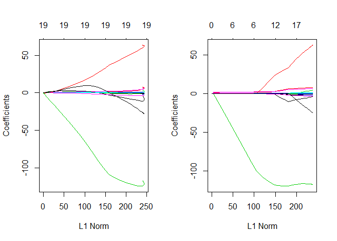
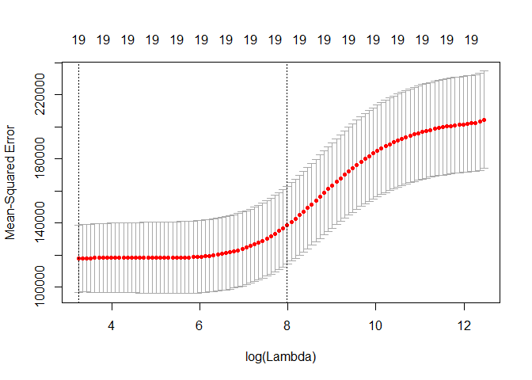

Untitled
================

GitHub Documents
----------------

This is an R Markdown format used for publishing markdown documents to GitHub. When you click the **Knit** button all R code chunks are run and a markdown file (.md) suitable for publishing to GitHub is generated.

Including Code
--------------

You can include R code in the document as follows:

``` r
summary(cars)
```

    ##      speed           dist       
    ##  Min.   : 4.0   Min.   :  2.00  
    ##  1st Qu.:12.0   1st Qu.: 26.00  
    ##  Median :15.0   Median : 36.00  
    ##  Mean   :15.4   Mean   : 42.98  
    ##  3rd Qu.:19.0   3rd Qu.: 56.00  
    ##  Max.   :25.0   Max.   :120.00

Including Plots
---------------

You can also embed plots, for example:


Note that the `echo = FALSE` parameter was added to the code chunk to prevent printing of the R code that generated the plot.

``` r
library(ISLR)
```

    ## Warning: package 'ISLR' was built under R version 3.6.1

``` r
data(Hitters)
head(Hitters)
```

    ##                   AtBat Hits HmRun Runs RBI Walks Years CAtBat CHits
    ## -Andy Allanson      293   66     1   30  29    14     1    293    66
    ## -Alan Ashby         315   81     7   24  38    39    14   3449   835
    ## -Alvin Davis        479  130    18   66  72    76     3   1624   457
    ## -Andre Dawson       496  141    20   65  78    37    11   5628  1575
    ## -Andres Galarraga   321   87    10   39  42    30     2    396   101
    ## -Alfredo Griffin    594  169     4   74  51    35    11   4408  1133
    ##                   CHmRun CRuns CRBI CWalks League Division PutOuts Assists
    ## -Andy Allanson         1    30   29     14      A        E     446      33
    ## -Alan Ashby           69   321  414    375      N        W     632      43
    ## -Alvin Davis          63   224  266    263      A        W     880      82
    ## -Andre Dawson        225   828  838    354      N        E     200      11
    ## -Andres Galarraga     12    48   46     33      N        E     805      40
    ## -Alfredo Griffin      19   501  336    194      A        W     282     421
    ##                   Errors Salary NewLeague
    ## -Andy Allanson        20     NA         A
    ## -Alan Ashby           10  475.0         N
    ## -Alvin Davis          14  480.0         A
    ## -Andre Dawson          3  500.0         N
    ## -Andres Galarraga      4   91.5         N
    ## -Alfredo Griffin      25  750.0         A

``` r
data <- na.omit(Hitters)

library(glmnet)
```

    ## Warning: package 'glmnet' was built under R version 3.6.1

    ## Loading required package: Matrix

    ## Loading required package: foreach

    ## Warning: package 'foreach' was built under R version 3.6.1

    ## Loaded glmnet 2.0-18

``` r
names(data)
```

    ##  [1] "AtBat"     "Hits"      "HmRun"     "Runs"      "RBI"      
    ##  [6] "Walks"     "Years"     "CAtBat"    "CHits"     "CHmRun"   
    ## [11] "CRuns"     "CRBI"      "CWalks"    "League"    "Division" 
    ## [16] "PutOuts"   "Assists"   "Errors"    "Salary"    "NewLeague"

``` r
X=model.matrix(Salary~.,data)[,-1]
y=data$Salary
```

``` r
sh <- 10^seq(10,-2,length=100)
Ridge <- glmnet(X,y,alpha=0, lambda=sh)
summary(Ridge)
```

    ##           Length Class     Mode   
    ## a0         100   -none-    numeric
    ## beta      1900   dgCMatrix S4     
    ## df         100   -none-    numeric
    ## dim          2   -none-    numeric
    ## lambda     100   -none-    numeric
    ## dev.ratio  100   -none-    numeric
    ## nulldev      1   -none-    numeric
    ## npasses      1   -none-    numeric
    ## jerr         1   -none-    numeric
    ## offset       1   -none-    logical
    ## call         5   -none-    call   
    ## nobs         1   -none-    numeric

``` r
Lasso <- glmnet(X,y, alpha=1, lambda=sh)
summary(Lasso)
```

    ##           Length Class     Mode   
    ## a0         100   -none-    numeric
    ## beta      1900   dgCMatrix S4     
    ## df         100   -none-    numeric
    ## dim          2   -none-    numeric
    ## lambda     100   -none-    numeric
    ## dev.ratio  100   -none-    numeric
    ## nulldev      1   -none-    numeric
    ## npasses      1   -none-    numeric
    ## jerr         1   -none-    numeric
    ## offset       1   -none-    logical
    ## call         5   -none-    call   
    ## nobs         1   -none-    numeric

``` r
par(mfrow=c(1,2))
plot(Ridge)
plot(Lasso)
```

    ## Warning in regularize.values(x, y, ties, missing(ties)): collapsing to
    ## unique 'x' values



``` r
CrossValidError = cv.glmnet(X,y,alpha=0)
plot(CrossValidError)
```



``` r
CrossValidError$lambda.min
```

    ## [1] 25.52821

``` r
coef(CrossValidError)
```

    ## 20 x 1 sparse Matrix of class "dgCMatrix"
    ##                         1
    ## (Intercept) 226.844379891
    ## AtBat         0.086613902
    ## Hits          0.352962515
    ## HmRun         1.144213851
    ## Runs          0.569353372
    ## RBI           0.570074066
    ## Walks         0.735072618
    ## Years         2.397356090
    ## CAtBat        0.007295083
    ## CHits         0.027995153
    ## CHmRun        0.208112349
    ## CRuns         0.056146219
    ## CRBI          0.058060281
    ## CWalks        0.056586702
    ## LeagueN       2.850306094
    ## DivisionW   -20.329125634
    ## PutOuts       0.049296951
    ## Assists       0.007063169
    ## Errors       -0.128066380
    ## NewLeagueN    2.654025549
