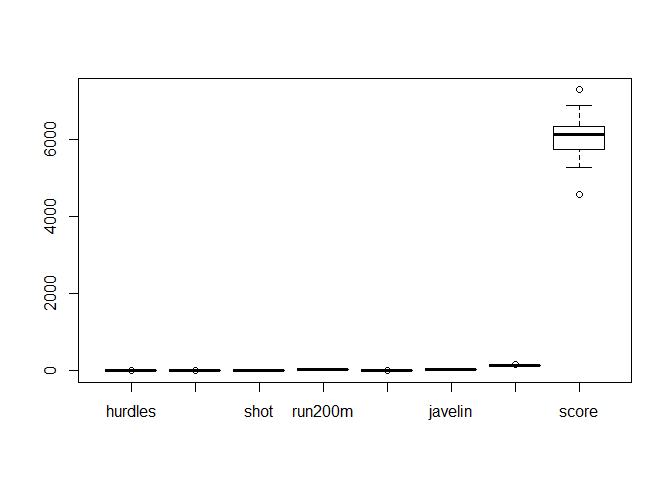

Rgit2
================

GitHub Documents
----------------

This is an R Markdown format used for publishing markdown documents to GitHub. When you click the **Knit** button all R code chunks are run and a markdown file (.md) suitable for publishing to GitHub is generated.

Including Code
--------------

You can include R code in the document as follows:

``` r
summary(cars)
```

    ##      speed           dist       
    ##  Min.   : 4.0   Min.   :  2.00  
    ##  1st Qu.:12.0   1st Qu.: 26.00  
    ##  Median :15.0   Median : 36.00  
    ##  Mean   :15.4   Mean   : 42.98  
    ##  3rd Qu.:19.0   3rd Qu.: 56.00  
    ##  Max.   :25.0   Max.   :120.00

Including Plots
---------------

You can also embed plots, for example:


Note that the `echo = FALSE` parameter was added to the code chunk to prevent printing of the R code that generated the plot.

``` r
library(HSAUR)
```

    ## Warning: package 'HSAUR' was built under R version 3.6.1

    ## Loading required package: tools

``` r
data(heptathlon)
head(heptathlon)
```

    ##                     hurdles highjump  shot run200m longjump javelin
    ## Joyner-Kersee (USA)   12.69     1.86 15.80   22.56     7.27   45.66
    ## John (GDR)            12.85     1.80 16.23   23.65     6.71   42.56
    ## Behmer (GDR)          13.20     1.83 14.20   23.10     6.68   44.54
    ## Sablovskaite (URS)    13.61     1.80 15.23   23.92     6.25   42.78
    ## Choubenkova (URS)     13.51     1.74 14.76   23.93     6.32   47.46
    ## Schulz (GDR)          13.75     1.83 13.50   24.65     6.33   42.82
    ##                     run800m score
    ## Joyner-Kersee (USA)  128.51  7291
    ## John (GDR)           126.12  6897
    ## Behmer (GDR)         124.20  6858
    ## Sablovskaite (URS)   132.24  6540
    ## Choubenkova (URS)    127.90  6540
    ## Schulz (GDR)         125.79  6411

``` r
summary(heptathlon)
```

    ##     hurdles         highjump          shot          run200m     
    ##  Min.   :12.69   Min.   :1.500   Min.   :10.00   Min.   :22.56  
    ##  1st Qu.:13.47   1st Qu.:1.770   1st Qu.:12.32   1st Qu.:23.92  
    ##  Median :13.75   Median :1.800   Median :12.88   Median :24.83  
    ##  Mean   :13.84   Mean   :1.782   Mean   :13.12   Mean   :24.65  
    ##  3rd Qu.:14.07   3rd Qu.:1.830   3rd Qu.:14.20   3rd Qu.:25.23  
    ##  Max.   :16.42   Max.   :1.860   Max.   :16.23   Max.   :26.61  
    ##     longjump        javelin         run800m          score     
    ##  Min.   :4.880   Min.   :35.68   Min.   :124.2   Min.   :4566  
    ##  1st Qu.:6.050   1st Qu.:39.06   1st Qu.:132.2   1st Qu.:5746  
    ##  Median :6.250   Median :40.28   Median :134.7   Median :6137  
    ##  Mean   :6.152   Mean   :41.48   Mean   :136.1   Mean   :6091  
    ##  3rd Qu.:6.370   3rd Qu.:44.54   3rd Qu.:138.5   3rd Qu.:6351  
    ##  Max.   :7.270   Max.   :47.50   Max.   :163.4   Max.   :7291

``` r
boxplot(heptathlon)
```



\`\`\`r attach(heptathlon) hurdles = max(hurdles) - hurdles run200m = max(run200m) - run200m run800m = max(run800m) - run800m \#
