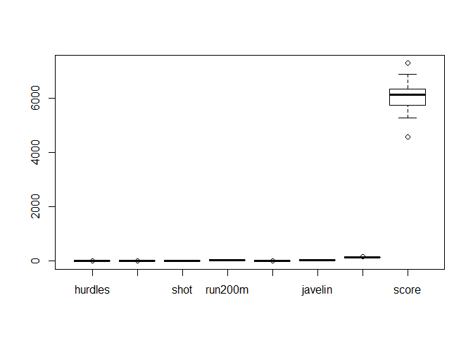
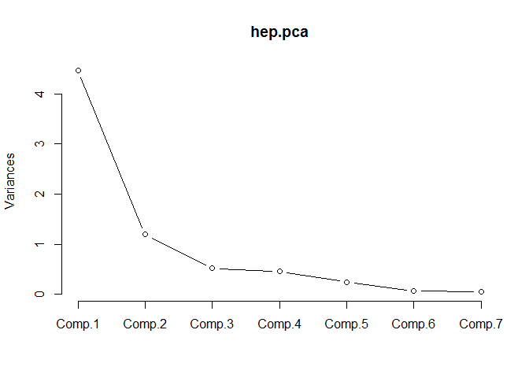
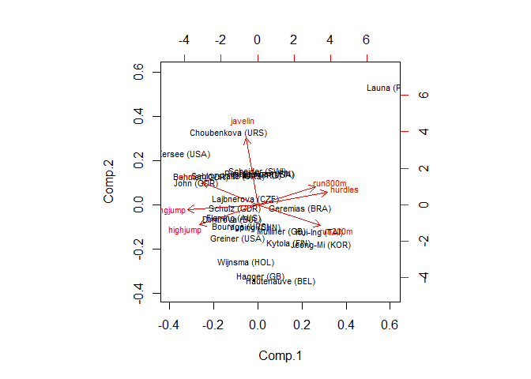

PCA
================

GitHub Documents
----------------

This is an R Markdown format used for publishing markdown documents to GitHub. When you click the **Knit** button all R code chunks are run and a markdown file (.md) suitable for publishing to GitHub is generated.

Including Code
--------------

You can include R code in the document as follows:

``` r
summary(cars)
```

    ##      speed           dist       
    ##  Min.   : 4.0   Min.   :  2.00  
    ##  1st Qu.:12.0   1st Qu.: 26.00  
    ##  Median :15.0   Median : 36.00  
    ##  Mean   :15.4   Mean   : 42.98  
    ##  3rd Qu.:19.0   3rd Qu.: 56.00  
    ##  Max.   :25.0   Max.   :120.00

Including Plots
---------------

You can also embed plots, for example:


Note that the `echo = FALSE` parameter was added to the code chunk to prevent printing of the R code that generated the plot.

``` r
library(HSAUR)
```

    ## Warning: package 'HSAUR' was built under R version 3.6.1

    ## Loading required package: tools

``` r
data(heptathlon)
head(heptathlon)
```

    ##                     hurdles highjump  shot run200m longjump javelin
    ## Joyner-Kersee (USA)   12.69     1.86 15.80   22.56     7.27   45.66
    ## John (GDR)            12.85     1.80 16.23   23.65     6.71   42.56
    ## Behmer (GDR)          13.20     1.83 14.20   23.10     6.68   44.54
    ## Sablovskaite (URS)    13.61     1.80 15.23   23.92     6.25   42.78
    ## Choubenkova (URS)     13.51     1.74 14.76   23.93     6.32   47.46
    ## Schulz (GDR)          13.75     1.83 13.50   24.65     6.33   42.82
    ##                     run800m score
    ## Joyner-Kersee (USA)  128.51  7291
    ## John (GDR)           126.12  6897
    ## Behmer (GDR)         124.20  6858
    ## Sablovskaite (URS)   132.24  6540
    ## Choubenkova (URS)    127.90  6540
    ## Schulz (GDR)         125.79  6411

``` r
summary(heptathlon)
```

    ##     hurdles         highjump          shot          run200m     
    ##  Min.   :12.69   Min.   :1.500   Min.   :10.00   Min.   :22.56  
    ##  1st Qu.:13.47   1st Qu.:1.770   1st Qu.:12.32   1st Qu.:23.92  
    ##  Median :13.75   Median :1.800   Median :12.88   Median :24.83  
    ##  Mean   :13.84   Mean   :1.782   Mean   :13.12   Mean   :24.65  
    ##  3rd Qu.:14.07   3rd Qu.:1.830   3rd Qu.:14.20   3rd Qu.:25.23  
    ##  Max.   :16.42   Max.   :1.860   Max.   :16.23   Max.   :26.61  
    ##     longjump        javelin         run800m          score     
    ##  Min.   :4.880   Min.   :35.68   Min.   :124.2   Min.   :4566  
    ##  1st Qu.:6.050   1st Qu.:39.06   1st Qu.:132.2   1st Qu.:5746  
    ##  Median :6.250   Median :40.28   Median :134.7   Median :6137  
    ##  Mean   :6.152   Mean   :41.48   Mean   :136.1   Mean   :6091  
    ##  3rd Qu.:6.370   3rd Qu.:44.54   3rd Qu.:138.5   3rd Qu.:6351  
    ##  Max.   :7.270   Max.   :47.50   Max.   :163.4   Max.   :7291

``` r
boxplot(heptathlon)
```



``` r
attach(heptathlon)
hurdles = max(hurdles) - hurdles
run200m = max(run200m) - run200m
run800m = max(run800m) - run800m 

library(stats)
hep.data = heptathlon[,-8]
hep.pca = princomp(hep.data, cor=T, scores=T)
names(hep.pca)
```

    ## [1] "sdev"     "loadings" "center"   "scale"    "n.obs"    "scores"  
    ## [7] "call"

``` r
hep.pca
```

    ## Call:
    ## princomp(x = hep.data, cor = T, scores = T)
    ## 
    ## Standard deviations:
    ##    Comp.1    Comp.2    Comp.3    Comp.4    Comp.5    Comp.6    Comp.7 
    ## 2.1119364 1.0928497 0.7218131 0.6761411 0.4952441 0.2701029 0.2213617 
    ## 
    ##  7  variables and  25 observations.

``` r
summary(hep.pca)
```

    ## Importance of components:
    ##                           Comp.1    Comp.2     Comp.3     Comp.4
    ## Standard deviation     2.1119364 1.0928497 0.72181309 0.67614113
    ## Proportion of Variance 0.6371822 0.1706172 0.07443059 0.06530955
    ## Cumulative Proportion  0.6371822 0.8077994 0.88222998 0.94753952
    ##                            Comp.5     Comp.6      Comp.7
    ## Standard deviation     0.49524412 0.27010291 0.221361710
    ## Proportion of Variance 0.03503811 0.01042223 0.007000144
    ## Cumulative Proportion  0.98257763 0.99299986 1.000000000

``` r
eig.val = hep.pca$sdev^2
eig.val
```

    ##     Comp.1     Comp.2     Comp.3     Comp.4     Comp.5     Comp.6 
    ## 4.46027516 1.19432056 0.52101413 0.45716683 0.24526674 0.07295558 
    ##     Comp.7 
    ## 0.04900101

``` r
screeplot(hep.pca, type="lines")
```



``` r
hep.pca$loadings[, 1:2]
```

    ##              Comp.1      Comp.2
    ## hurdles   0.4528710  0.15792058
    ## highjump -0.3771992 -0.24807386
    ## shot     -0.3630725  0.28940743
    ## run200m   0.4078950 -0.26038545
    ## longjump -0.4562318 -0.05587394
    ## javelin  -0.0754090  0.84169212
    ## run800m   0.3749594  0.22448984

``` r
hep.pca$scores[,1:2]
```

    ##                          Comp.1      Comp.2
    ## Joyner-Kersee (USA) -4.20643487  1.26802363
    ## John (GDR)          -2.94161870  0.53452561
    ## Behmer (GDR)        -2.70427114  0.69275901
    ## Sablovskaite (URS)  -1.37105209  0.70655862
    ## Choubenkova (URS)   -1.38704979  1.78931718
    ## Schulz (GDR)        -1.06537236 -0.08104469
    ## Fleming (AUS)       -1.12307639 -0.33042906
    ## Greiner (USA)       -0.94221015 -0.82345074
    ## Lajbnerova (CZE)    -0.54118484  0.14933917
    ## Bouraga (URS)       -0.77548704 -0.53686251
    ## Wijnsma (HOL)       -0.56773896 -1.42507414
    ## Dimitrova (BUL)     -1.21091937 -0.36106077
    ## Scheider (SWI)       0.01578005  0.82307249
    ## Braun (FRG)          0.00385205  0.72953750
    ## Ruotsalainen (FIN)   0.09261899  0.77877955
    ## Yuping (CHN)        -0.14005513 -0.54831883
    ## Hagger (GB)          0.17465745 -1.77914066
    ## Brown (USA)          0.52996001  0.74195530
    ## Mulliner (GB)        1.14869009 -0.64788023
    ## Hautenauve (BEL)     1.10808552 -1.88531477
    ## Kytola (FIN)         1.47689483 -0.94353198
    ## Geremias (BRA)       2.05556037 -0.09495979
    ## Hui-Ing (TAI)        2.93969248 -0.67514662
    ## Jeong-Mi (KOR)       3.03136461 -0.97939889
    ## Launa (PNG)          6.39931438  2.89774561

``` r
biplot(hep.pca, cex=0.7)
```


